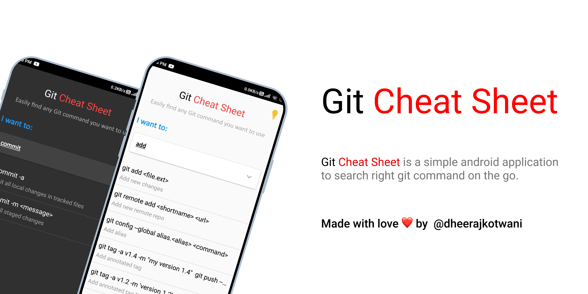
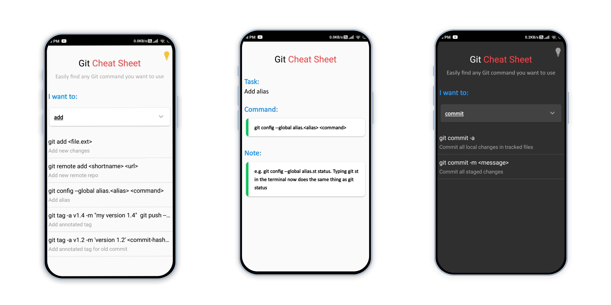

# Git Cheat Sheet

#### Git Cheat Sheet is an Android Application to easily search any Git Command on the go. 🔥

## App Link
##### You can directly download the latest version of the app from the play store. 🎯

## 🔥 Features
- Easily Search any Git Command. 
- View Usage and implementation of Git Command

## 🛠 Tech Used
- Kotlin
- Json
 
## 📷 Screen Shots

## Donate
##### If you like the project and wanna support me develop new stuff, You can buy me a coffee.

## License
##### You can find the  for the app here.

## If you liked the project don't forget to star 🌟 and fork 🍽 the project.

## Connect - Let's become friends:

 
<h2 align="center">Made with ❤ by Dheeraj Kotwani</h2>			
